# Qwen3.5-4B INT4 Quantization Benchmark (DGX Spark / GB10)

Side-by-side comparison of **BF16**, **INT8 W8A8**, and several **W4A16 INT4** methods on [Qwen/Qwen3.5-4B](https://huggingface.co/Qwen/Qwen3.5-4B), evaluated for quality (perplexity + lm-eval) and vLLM serving speed on a multi-tenant **NVIDIA DGX Spark (GB10 Blackwell, aarch64)**.

> **Not an A100/H100 speed claim.** Absolute tok/s and TTFT here reflect a shared GB10 with unified memory and conservative `gpu_memory_utilization`. Use these numbers to compare *methods against each other* on the same box; quality deltas are the primary takeaway.

## Hardware

| Item | Value |
|---|---|
| Machine | NVIDIA DGX Spark (`gx10-a4ea`) |
| GPU | NVIDIA GB10 (Blackwell), driver 580.173.02 |
| Memory | ~128 GB unified system memory (reported ~121 GiB) |
| CPU | ARM Cortex-X925 / A725, 20 cores, aarch64 |
| OS | Ubuntu, Linux 6.17.0-1032-nvidia |
| Tenancy | Multi-tenant — other users/jobs may share the machine |

## Goal

Quantize and serve the same base model under identical calibration and eval configs, then answer:

1. How much WikiText-2 / MMLU / GSM8K / ARC-C / HellaSwag quality is lost vs BF16?
2. How much decode / throughput / weight memory do INT8 and INT4 buy on GB10 + vLLM?
3. How expensive is each quantization (wall time)?

## Methods (one-line principle)

| Method | Principle |
|---|---|
| **BF16** | Unquantized baseline weights in bfloat16. |
| **INT8 W8A8 (SQ+GPTQ)** | SmoothQuant migrates activation outliers into weights; GPTQ then packs per-channel int8 weights with dynamic per-token int8 activations (W8A8). |
| **RTN** | Round-to-nearest / absmax W4A16 per group (g=128); no calibration optimization. |
| **GPTQ (act-order)** | Second-order Hessian GPTQ with static activation order (columns by descending Hessian diag; contiguous groups; no `g_idx` at inference). |
| **AWQ** | Activation-aware weight quantization: search per-channel scales that protect salient weights (asymmetric W4A16, duo scaling). |
| **HQQ** | Half-Quadratic Quantization: proximal iterations to fit scales/zeros without a large calibration set (integer zero points for vLLM). |
| **AutoRound** | SignSGD-tuned rounding / scaling over calibration tokens (iters=200) for W4A16. |

Shared settings: calibration = 256×2048 tokens from `NeelNanda/pile-10k` (concat-and-chunk, seed 0); W4 group size 128. See `configs/quant.yaml`.

## Results

Measured 2026-10-02 KST on the Spark box above. Full table also in [`results/summary.md`](results/summary.md).

| Method | WikiText-2 PPL ↓ | MMLU (0-shot) | GSM8K (5-shot, flex) | ARC-C (acc_norm) | HellaSwag (acc_norm) | TTFT b1 (ms) | Decode tok/s b1 | Throughput b1 / b8 / b32 (tok/s) | Weights mem (GiB) | Quant time |
|---|---|---|---|---|---|---|---|---|---|---|
| BF16 | 9.579 | 76.32 | 76.00 | 54.35 | 65.50 | 137.4 | 20.5 | 20 / 171 / 445 | 7.99 | n/a |
| INT8 W8A8 (SQ+GPTQ) | 9.656 | 75.96 | 72.40 | 55.12 | 64.30 | 163.3 | 38.3 | 38 / 238 / 521 | 4.73 | 24.4 min |
| RTN | 10.628 | 73.51 | 75.60 | 53.84 | 63.80 | 139.1 | 58.4 | 57 / 334 / 637 | 3.11 | 35 s |
| GPTQ (act-order) | 10.103 | 75.09 | 71.60 | 52.82 | 63.90 | 139.3 | 58.4 | 57 / 335 / 639 | 3.11 | 15.0 min |
| AWQ | 9.965 | 74.74 | 76.40 | 53.07 | 64.30 | 143.3 | 58.1 | 56 / 332 / 631 | 3.13 | 84.8 min |
| HQQ | 9.922 | 74.62 | 73.20 | 51.71 | 63.90 | 144.2 | 57.9 | 56 / 331 / 631 | 3.13 | 82 s |
| AutoRound | 9.898 | 75.67 | 73.20 | 52.30 | 63.80 | 142.8 | 58.4 | 57 / 335 / 638 | 3.11 | 51.1 min |

### Plots

#### Quality

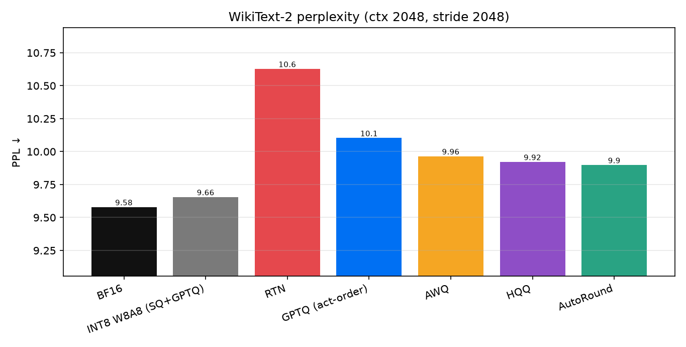

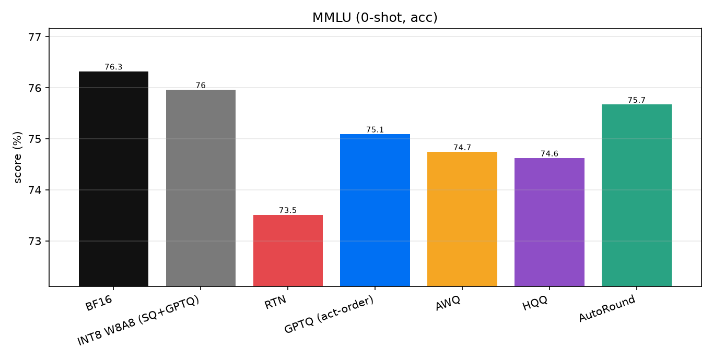

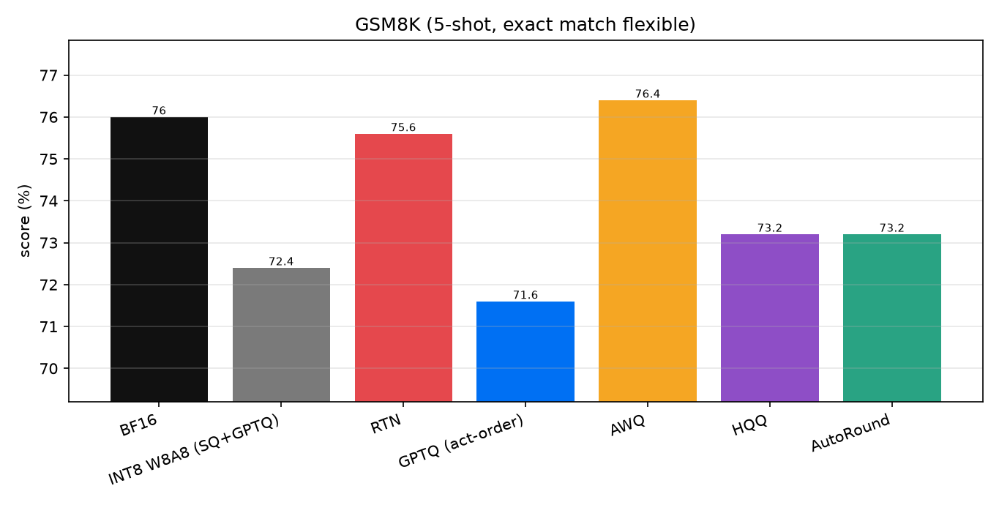

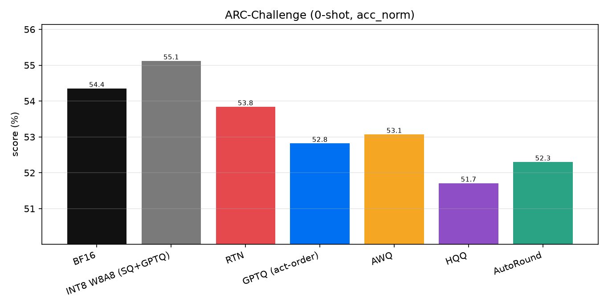

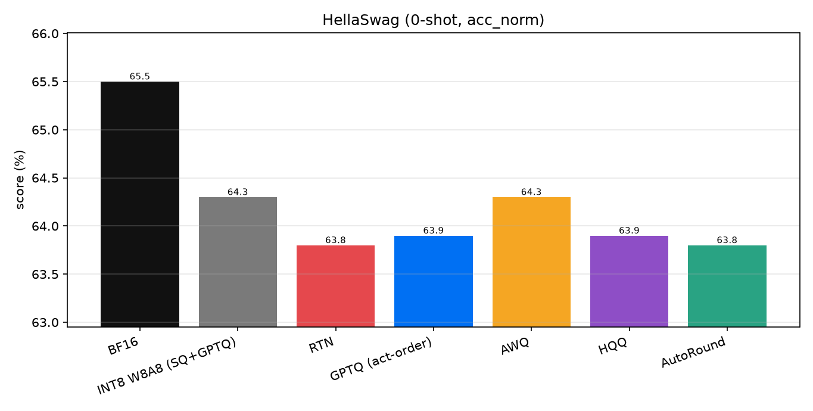

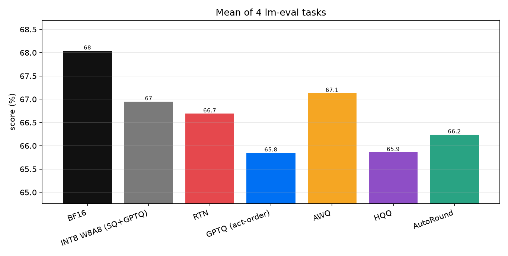

#### Speed & memory

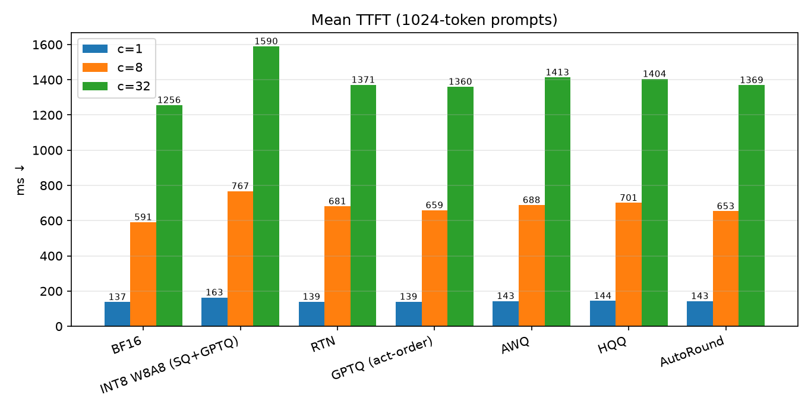

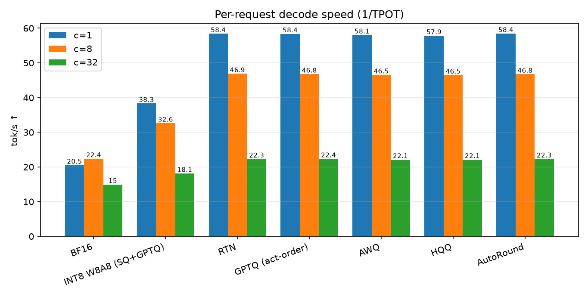

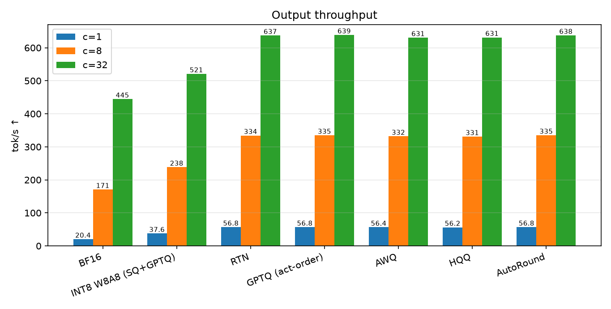

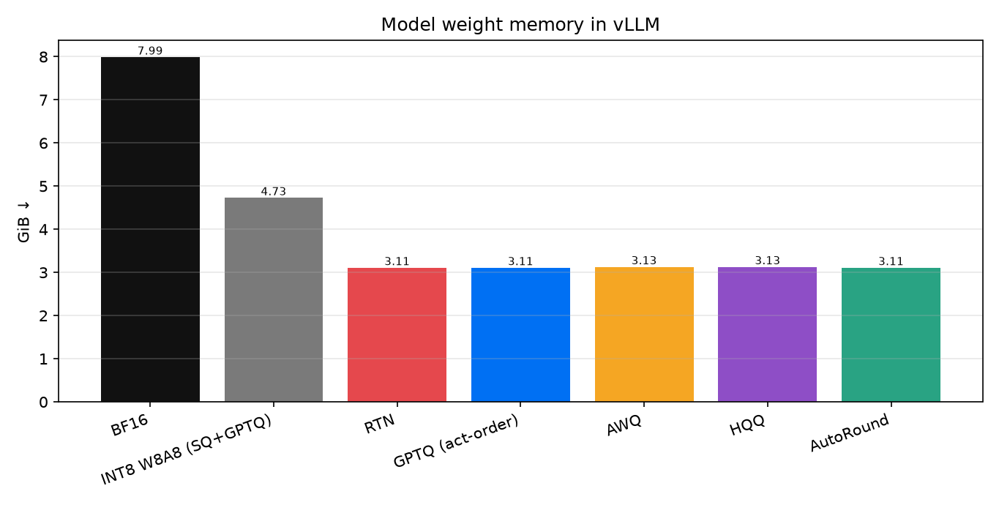

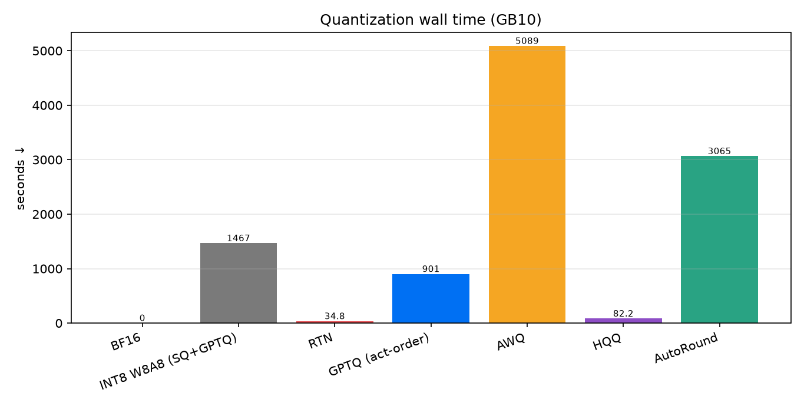

#### Trade-offs

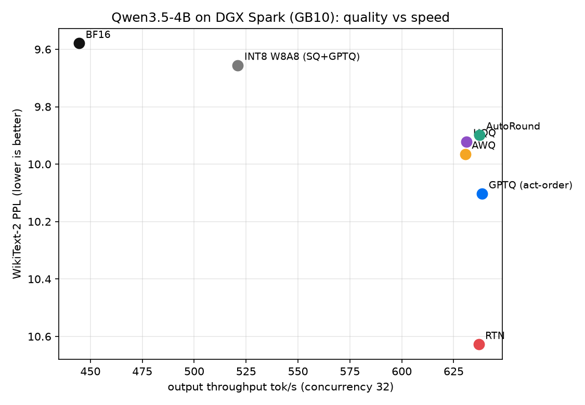

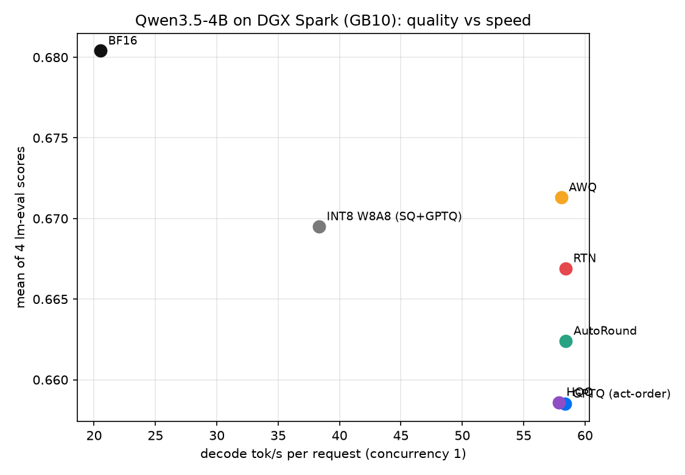

## Conclusions

Grounded in the table above (same machine, same configs):

1. **INT4 W4A16 ~2.9× decode vs BF16, ~2.6× weight shrink.** All INT4 methods land near **58 tok/s** decode (b1) and **~3.1 GiB** weights vs BF16 **20.5 tok/s / 7.99 GiB**. Batch-32 throughput rises from **445 → ~630–639 tok/s**.
2. **AutoRound wins INT4 perplexity** (PPL **9.898**, closest to BF16 9.579) with strong MMLU (**75.67**). **HQQ** is close on PPL (**9.922**) and finishes in **~82 s**. **AWQ** is best on GSM8K (**76.40**, slightly above BF16) but the slowest quant (**84.8 min**).
3. **RTN is the cheapest INT4** (**35 s**) and still competitive on GSM8K (**75.60**), but pays the largest PPL / MMLU tax (**10.628 / 73.51**). Prefer RTN only when quant wall-time dominates.
4. **INT8 W8A8 is the quality-preserving middle ground:** PPL **9.656** and MMLU **75.96** nearly match BF16, ARC-C even edges BF16 (**55.12**), with **~1.9×** decode and **4.73 GiB** weights — but TTFT is higher (**163 ms**) and decode (**38 tok/s**) lags all INT4 packs on this GB10 Triton path.
5. **Among INT4 packs, serving speed is essentially tied** on GB10 (decode 57.9–58.4, thrpt b32 631–639). Choose by **quality vs quant time**, not by runtime: AutoRound / HQQ for PPL, AWQ for GSM8K, GPTQ if you want a classic Hessian method in **15 min**, RTN for a quick baseline.

## Substitutions & limits

Documented in `configs/eval.yaml` / `configs/quant.yaml`:

| Topic | What we did | Why |
|---|---|---|
| lm-eval subsample | MMLU **30/subject** (0-shot), GSM8K **250**, ARC-C **full** (1,172), HellaSwag **1000**; identical first-N docs for every model | Full MMLU (~56k loglikelihood reqs) was ~4–6 h/model on shared GB10 |
| MMLU shots | **0-shot** (not 5-shot) | 5-shot vocab-wide prompt-logprob scoring was ~5 h/model on GB10 |
| INT8 runtime | W8A8 via **Triton int8 kernel** on GB10 | Path used for serving INT8 on this platform |
| Modules kept BF16 | Vision tower; `lm_head` / `embed_tokens`; Gated-DeltaNet `in_proj_a` / `in_proj_b` | Text-only bench + vLLM loadability; tied 248k vocab; 32-wide outputs too narrow for Marlin W4 tile (`in_proj_ba`) |
| HQQ zeros | **Integer** zero points | vLLM only loads integer zero points for this path |
| GPTQ act-order | **Static** act-order (contiguous groups; no `g_idx`) | llm-compressor 0.14 dropped the `g_idx` (“group”) variant |
| vLLM memory | `gpu_memory_utilization: 0.16`, `max_model_len: 4096`, `language_model_only: true` | Multi-tenant Spark; leave headroom for other jobs |
| Calibration | 256 samples × 2048 tokens, pile-10k, seed 0 | Same tokens for every calibration-based method |

Smoke runs under `results/raw/*/bf16_smoke*` are early sanity checks, not the published numbers.

## Reproduction

```bash
# On a machine with the model cache / GPU access:
./scripts/setup_env.sh          # creates .venv-quant and .venv-eval (uv)

# Quantize all methods (writes gitignored models/<name>/):
bash scripts/run_quant_all.sh

# End-to-end eval → bench → aggregate → plots:
bash scripts/run_pipeline.sh
# Or stepwise:
#   bash scripts/run_eval_all.sh
#   bash scripts/run_bench_all.sh
#   .venv-eval/bin/python scripts/aggregate.py
#   .venv-eval/bin/python scripts/plots.py
```

Key knobs: `configs/quant.yaml`, `configs/eval.yaml`, `configs/models.yaml`. Checkpoints are **not** in git (`models/`, `*.safetensors` ignored); re-run quant or point `configs/models.yaml` at your own paths.

## Versions

Captured on the benchmark host at publish time:

| Component | Version |
|---|---|
| Python (both venvs) | 3.12.14 |
| torch (quant + eval) | 2.13.0+cu130 |
| transformers (quant / eval) | 5.17.0 / 5.18.0 |
| vLLM | 0.30.0 |
| lm-evaluation-harness | 0.4.13 |
| llmcompressor | 0.14.0 |
| auto-round | 0.15.1 |
| hqq | 0.2.8.post1 |
| compressed-tensors | 0.19.0 |
| datasets | 5.0.1 |
| Base model revision | `851bf6e806efd8d0a36b00ddf55e13ccb7b8cd0a` (`Qwen/Qwen3.5-4B`) |
| NVIDIA driver | 580.173.02 |
| Kernel | 6.17.0-1032-nvidia aarch64 |

Install pins live in [`scripts/setup_env.sh`](scripts/setup_env.sh).

## License / notes

Benchmark scripts and published metrics in this repo. Model weights remain under their upstream licenses (Qwen). Do not treat GB10 tok/s as portable to discrete datacenter GPUs.
